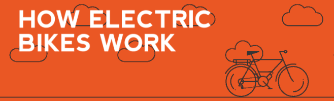
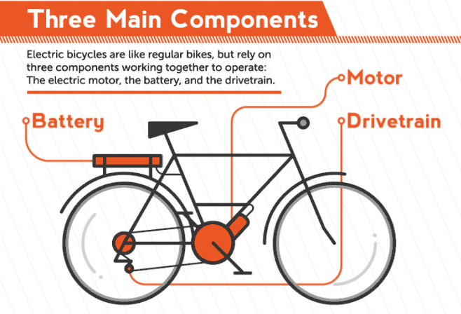
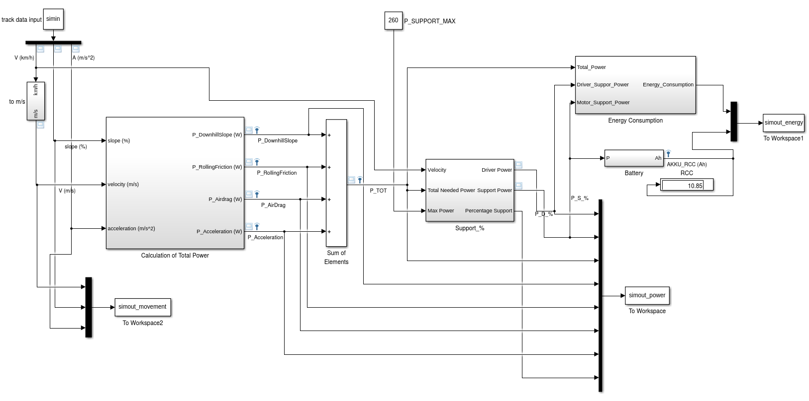
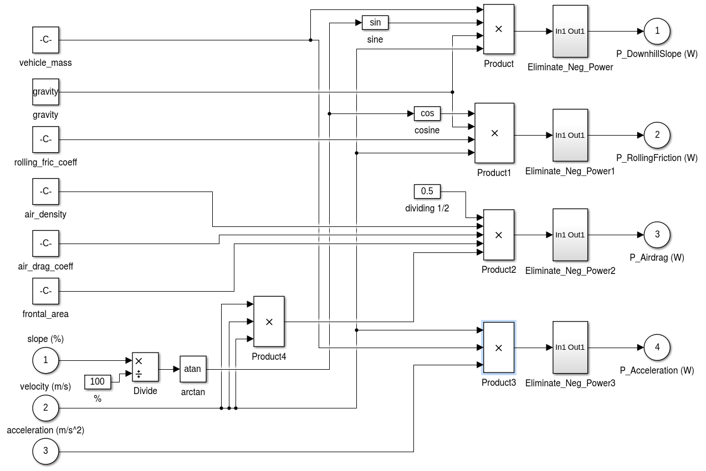
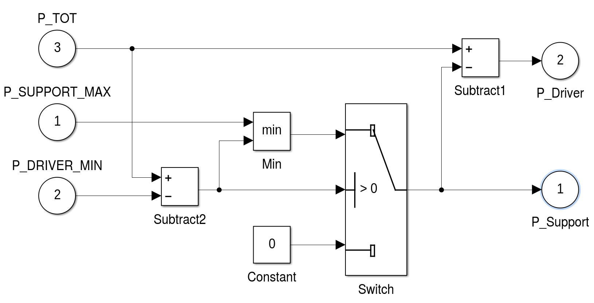
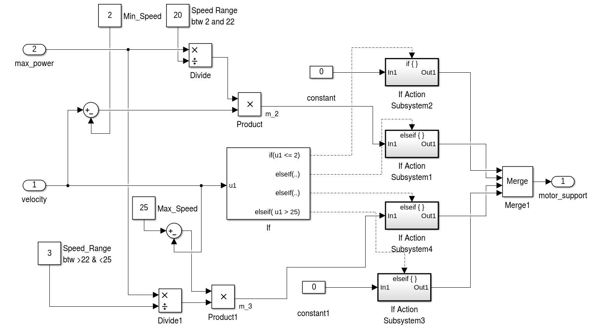
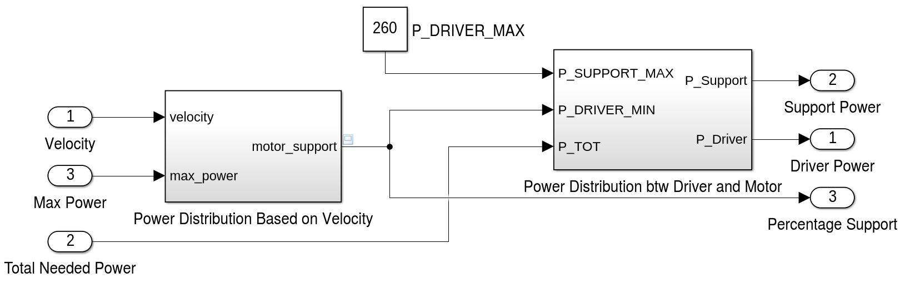
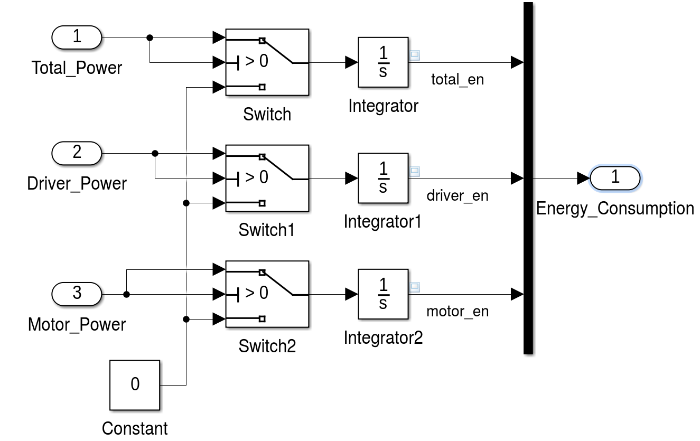

# Modeling Pedal Electric Bike’s Electric Motor Support with Simulink

Reader can refer to the [report](report/slides.pdf) for technical details.

E-bike is a general term that refers to different kinds of bicycles that can be powered
either by an electric motor, the drivers own muscle-power or a combination of both. This kind of
e-bike can be considered as a hybrid electric vehicle and is motor and human powered.
By statutory rule it is only allowed to assist the driver while he is actively pedaling and
only up to a velocity of 25 km/h. Above this velocity the full power has to be provided
by the driver alone and the motor has to be automatically shut off.

The simulation has to use a method to distribute the power between driver and bike
to consider those legal requirements. For this the template model uses a fixed minimal
driver power. If the power over a segment is below this parameter value, the driver
has to provide all the power. Should p i exceed the minimal driver power, then the motor
will support up to its maximum power. Other methods of balancing the power between
driver and bike are left as an exercise. Finally, to draw a conclusion after the simulation, the total energy used by the motor
has to be compared to the current capacity of the bikes battery. If the computed total
energy is larger than the capacity of the bikes battery, the track can not
be driven with the motor support distribution used by the simulation. The simulation
template includes a simple virtual battery subsystem that continually drains energy from
a initial battery capacity.

## Overall E-Bike Simulink Model

## Subsystem of Power Calculation

## Subsystem of Power Support

## Power Support Based on Speed

## Power Distribution Between Driver and Motor

## Energy Consumption

